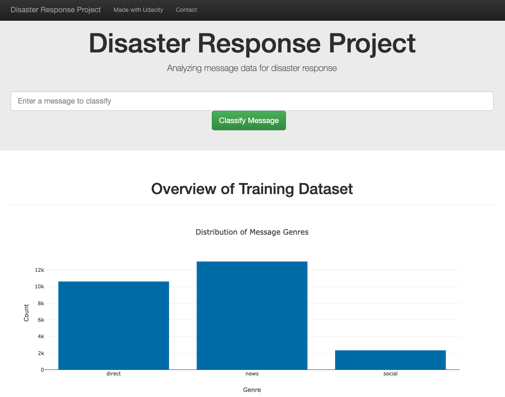
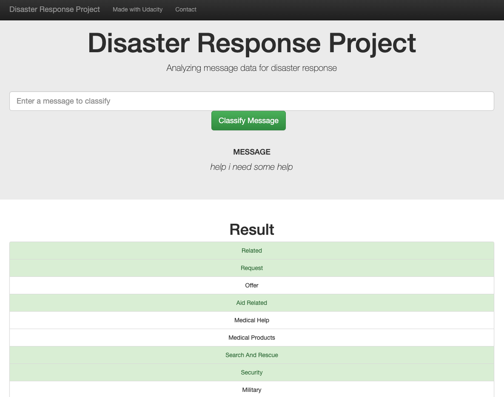

# Disaster Response Web App

## Table of Contents

1. [Project Overview](#overview)
2. [Setup/Testing Instructions](#setup)
3. [File Descriptions](#files)
4. [Results](#results)
5. [Licensing, Authors, and Acknowledgements](#licensing)

## Project Overview <a name="overview"></a>

In this project I was given the task of developing a machine learning (ML) model that can take input of message, and then classifies the message to help direct the message sender to the appropriate assistance needed.  To build this model I developed a script to process the training/test data for the ML model. Once the data was successfully processed I think went through different processes to see which hyper-parameters would produce the best model for this project.  Finally, after the model was successfully trained, I then configured a Flask app that was provided by Udacity to utilize my database and ML model developed.

## Setup/Testing Instructions <a name="setup"></a>

Git clone this repo to your local environment and then run the following commands in a new terminal.

```bash
$ cd dsn_disaster_response_webapp
$ conda env create -f environment.yml
$ conda activate dr-app
$ cd main/app
$ python run.py
```

Now open a new web browser and [http://localhost:3001/](http://localhost:3001/)



When you enter a message into the text field and click **Classify Message**. You will see the category(ies) that best represent the message.



## File Descriptions <a name="files"></a>

## Results <a name="results"></a>

## Licensing, Authors, Acknowledgements <a name="licensing"></a>